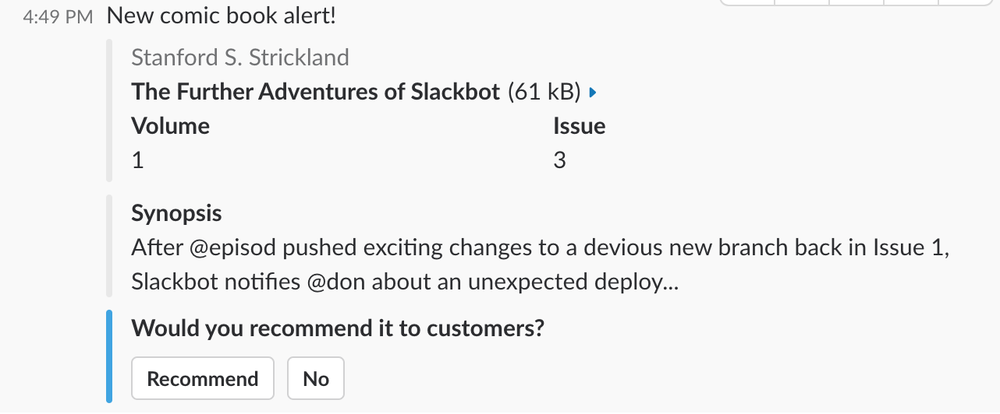

# Webhooks 

# Adding a webhook
Basic Information -> Add features and functionality -> Incoming Webhooks

# Using a webhook
After enabling this feature, Slack will generate a Webhook URL for you. To post a message, send your message as a JSON POST request.

**Example 1**    
```
curl -X POST -H 'Content-type: application/json' --data '{"text":"Hello, World!"}' https://hooks.slack.com/services/myurl

``` 
Result: &nbsp; &nbsp; &nbsp;  

**Example 2**  
You can also add formatting and interactivity to messages. See Slack's [message formatting](https://api.slack.com/docs/message-formatting), and [interactive messages](https://api.slack.com/interactive-messages) pages.
  
```
curl -X POST -H 'Content-type: application/json' --data '{
    "text": "New comic book alert!",
    "attachments": [
        {
            "title": "The Further Adventures of Slackbot",
            "fields": [
                {
                    "title": "Volume",
                    "value": "1",
                    "short": true
                },
                {
                    "title": "Issue",
                    "value": "3",
            "short": true
                }
            ],
            "author_name": "Stanford S. Strickland",
            "author_icon": "http://a.slack-edge.com/7f18https://cfr.slack-edge.com/bfaba/img/api/homepage_custom_integrations-2x.png",
            "image_url": "http://i.imgur.com/OJkaVOI.jpg?1"
        },
        {
            "title": "Synopsis",
            "text": "After @episod pushed exciting changes to a devious new branch back in Issue 1, Slackbot notifies @don about an unexpected deploy..."
        },
        {
            "fallback": "Would you recommend it to customers?",
            "title": "Would you recommend it to customers?",
            "callback_id": "comic_1234_xyz",
            "color": "#3AA3E3",
            "attachment_type": "default",
            "actions": [
                {
                    "name": "recommend",
                    "text": "Recommend",
                    "type": "button",
                    "value": "recommend"
                },
                {
                    "name": "no",
                    "text": "No",
                    "type": "button",
                    "value": "bad"
                }
            ]
        }
    ]
}' https://hooks.slack.com/services/myurl
```
Result: &nbsp; &nbsp; &nbsp;  